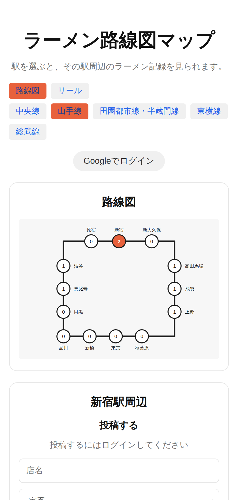
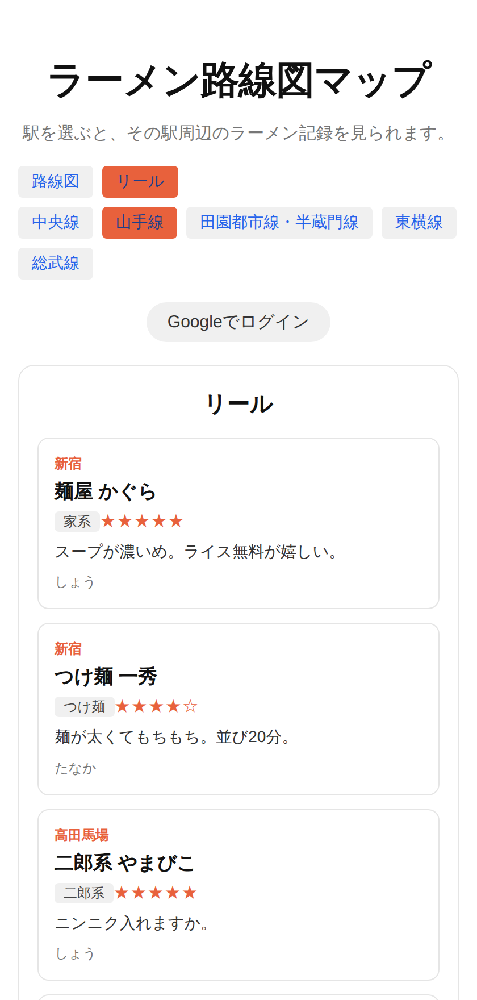

# ラーメン路線図マップ

駅を選ぶと、その駅周辺のラーメン記録を見られる個人開発のWebアプリ。
路線図上の丸の中の数字が、その駅に登録された記録の件数になっている。

**公開URL: https://ramen-line-map.vercel.app**（ログインなしで閲覧だけ試せます）

<p>
  
  
</p>

<sub>※ スクリーンショットはサンプルデータで撮影したもの</sub>

## できること

- **路線図タブ** … 5路線（中央線 / 山手線 / 田園都市線・半蔵門線 / 東横線 / 総武線）を切り替えて駅を選び、その駅のラーメン記録を見る・投稿する
- **リールタブ** … 路線に関係なく新着50件を流し見する
- 投稿には5段階の星評価と写真を添えられる（写真は Supabase Storage に保存）
- Googleログイン。未ログインでも閲覧はできるが、投稿はできない

## 技術構成

| 領域 | 使ったもの |
| --- | --- |
| フロント | React 18 + Vite（ルーティング無しの1画面構成） |
| 描画 | SVG を直接組み立て（路線図ライブラリは使っていない） |
| バックエンド | Supabase（PostgreSQL / Auth / Storage） |
| ホスティング | Vercel |
| 品質 | ESLint / Vitest / GitHub Actions |

## なぜこの構成にしたか

### サーバーを書かず Supabase にした

当初は Node.js + Express でAPIを書く構成で設計していたが、この規模だと
「Expressを1枚挟むだけの層」になり、CORS設定とデプロイ先が1つ増えるコストに見合わなかった。
Supabaseは中身がPostgreSQLなので、後からサーバーを挟む形に移行しても
テーブル設計はそのまま使える。まず動くものを出すことを優先した。

代わりにアクセス制御をアプリ側で書けなくなるため、**RLS（Row Level Security）**で担保している。
anonキーはブラウザに露出する前提のキーなので、RLSを有効にしないと
誰でも他人の投稿を削除できてしまう。

```sql
create policy "本人だけ削除できる"
  on public.posts for delete
  using (auth.uid() = user_id);
```

同じ考え方を Storage にも適用していて、画像は `{user_id}/xxxx.jpg` というパスで保存し、
「パスの1階層目が自分のuser_idと一致するか」で本人判定している。

### 認証をGoogleログインのみにした

ラーメンの記録という、そこまで真剣に管理したくないデータなので、
パスワードを覚えさせる価値がないと判断した。
メール認証を用意すると確認メールの実装も必要になる。

## 工夫した点

### 1. 路線図を「地理」ではなく「見やすさ」で設計した

実際の緯度経度で描くと、路線が斜めに走って駅名が重なり、スマホで読めなくなる。
そこで実際の地図は捨て、**駅の座標を手打ちで決める方式**にした。

```js
{ id: "shinokubo", name: "新大久保", x: 400, y: 55, label: "top", corner: [470, 55] },
```

- `label` … 駅名を丸のどちら側に置くか。自動配置だと重なるので上下左右を手で振り分けた
- `corner` … 次の駅へ行く途中で曲がる点。斜めの線を出さず、路線図らしい直角の折れ線にするために使う
- `loop` … 山手線だけ、最後の駅と最初の駅を結ぶ

SVGの `viewBox` を指定してあるので、スマホでもPCでも自動で拡大縮小される。
px単位でのレスポンシブ対応が不要になった。

手打ちのデータは打ち間違いが怖いので、そこはテストで押さえている（後述）。

### 2. 駅IDを路線をまたいで共通にした

渋谷は東横線と田園都市線と山手線に出てくるが、すべて `shibuya` という同じIDにしている。
これによりどの路線から見ても件数が一致し、駅の重複を意識せずに済む。

### 3. 件数の取得を1リクエストにまとめた

駅ごとに件数を問い合わせると、山手線だけで13回リクエストが飛ぶ。
`station_id` だけを全件取得してブラウザ側で数える方式にして、1回に抑えた。

```js
const { data } = await supabase.from("posts").select("station_id");
```

件数が数万件規模になったらSQL側の `group by` に切り替える前提で、
コードにその旨をコメントとして残してある。

### 4. 「読み込み中」を state で持たず、導出した

駅を切り替えた直後に前の駅の投稿が新しい見出しの下に残るのが気になったので、
取得結果を「どの駅のものか」と一緒に保持し、表示中の駅と食い違っている間を
読み込み中として扱うようにした。state を増やさずに、古いデータが見える状態を
構造的に作れなくしている。

```js
const [loaded, setLoaded] = useState({ stationId: null, posts: [] });
const postsLoading = loaded.stationId !== stationId;
const posts = postsLoading ? [] : loaded.posts;
```

通信の後勝ちも起きるので、`useEffect` のクリーンアップで古いリクエストの結果を捨てている。

### 5. 投稿者名をあえて非正規化した

表示のたびに `auth.users` を引きに行くのが面倒だったので、
投稿時点の名前を `posts.user_name` に持たせている。
名前を変えても過去の投稿には反映されないというトレードオフを承知の上で採用した。

## 品質担保

手打ちの座標データとSVGの座標計算が壊れやすい部分なので、そこにテストを寄せている。

```bash
npm run lint   # ESLint
npm test       # Vitest（27件）
npm run build
```

- `src/data/lines.test.js` … 座標データの整合性。同じIDの駅が路線をまたいで同じ名前か、
  座標が重複していないか、viewBoxの内側に収まっているかを機械的に検査する。
  路線を足した時にここが落ちれば、画面を開く前に気づける
- `src/components/LineMap.test.js` … 線分の組み立て（`corner` での折れ、環状線の閉じ）と
  駅名ラベルの位置計算
- `src/lib/storage.test.js` … アップロード前の検証と、公開URLからのパス抽出

上記3つは GitHub Actions で push / PR ごとに回している（`.github/workflows/ci.yml`）。

## 詰まった点と解決

### SVGの座標系で上下が逆になった

`y` を大きくすれば上に行くと思っていたが、SVGは**左上が原点で、yは下方向に増える**。
数学のグラフと逆で、路線図が上下反転した状態で描画された。
`lines.js` のy座標をすべて「上から数えた値」に書き直して解決。

### 本番でログイン後にlocalhostへ飛ばされた

Supabaseの Redirect URLs にVercelのURLを登録していなかったため。
ローカルでは動くので気づきにくい。
`redirectTo` は `window.location.origin` にして、環境ごとに固定値を書かないようにした。

### 描画順で線が丸の上に乗った

SVGは後に書いた要素が手前に来る。丸を先に描いたせいで、駅の丸の上を線が横切っていた。
**線 → 丸 → 文字**の順に描くよう並べ替えて解決。

### `.env` が無いと画面が真っ白になった

`createClient()` は空文字を渡すと例外を投げるため、環境変数を入れ忘れた状態だと
コンソールにしかエラーが出ず、画面には何も表示されなかった。
セットアップ手順を画面に出すコンポーネントを用意し、未設定ならそちらを描画するようにした。

## 既知の制約

- 表示名（`user_name`）は Supabase の `user_metadata` 由来で、クライアントから変更できる。
  RLSは `user_id` で判定しているので投稿の改ざんはできないが、**表示名は詐称できる**。
  本気で防ぐなら `auth.users` を参照するビューを挟む必要がある
- 件数集計は全件取得してブラウザ側で数えているので、数万件規模になると破綻する
- 画像を削除する時、投稿レコードの削除が成功した後に Storage の削除が失敗すると
  ファイルだけが残る（投稿は消えているので表示上の実害はない）
- Supabaseの無料プロジェクトは1週間アクセスがないと一時停止する

## 今後やるなら

- 件数集計を `group by` に切り替える
- 路線の追加（`lines.js` に座標を足すだけで増やせる構造にしてある）
- 「行きたい」ブックマーク機能

## セットアップ

### 1. Supabase

プロジェクトを作成し、SQL Editor で `supabase/schema.sql` を実行する。
テーブル・RLSポリシー・Storageバケットが作られる。何度実行しても同じ結果になるようにしてある。

### 2. Googleログイン

1. Google Cloud Console で OAuth クライアント ID（ウェブアプリケーション）を作成
2. Supabase の Authentication → Providers → Google に Client ID と Secret を登録
3. Supabase 側に表示される Callback URL を Google の「承認済みのリダイレクト URI」に登録
4. Authentication → URL Configuration で Site URL と Redirect URLs を設定

### 3. 環境変数

`.env.example` をコピーして `.env` を作る。値は Supabase の Project Settings → API から取得する。

```
VITE_SUPABASE_URL=https://xxxxxxxxxxxx.supabase.co
VITE_SUPABASE_ANON_KEY=sb_publishable_xxxxxxxxxxxxxxxxxxxx
```

### 4. 起動

```bash
npm install
npm run dev
```

### 5. デプロイ（Vercel）

リポジトリをImportし、環境変数2つを登録するだけ。
デプロイ後、発行されたURLをSupabaseのRedirect URLsに追加すること。

## ディレクトリ構成

```
src/
├─ App.jsx                 タブ・ログイン状態・データ取得
├─ main.jsx                エントリ。.env 未設定なら SetupNotice を出す
├─ data/lines.js           路線と駅の座標データ
├─ lib/
│  ├─ supabase.js          Supabaseクライアント
│  └─ storage.js           画像のアップロード・削除・検証
└─ components/
   ├─ LineMap.jsx          SVGの路線図
   ├─ StationPanel.jsx     駅ごとの投稿エリア
   ├─ PostForm.jsx
   ├─ PostList.jsx
   ├─ PostCard.jsx         投稿カードの共通部分
   ├─ Reel.jsx
   ├─ Stars.jsx            星評価の表示
   └─ SetupNotice.jsx      .env 未設定時の案内
supabase/schema.sql        テーブル定義・RLSポリシー・Storageバケット
docs/                      設計メモ（関数一覧など）
```

## 開発について

個人開発。画面設計、路線図の座標設計、データ構造、技術選定はすべて自分で決めた。

実装にはAI（Claude）を併用している。生成されたコードは仕様通りか自分で確認した上で採用し、
SVGの座標系の反転や描画順の問題、本番だけログイン後のリダイレクト先がずれる問題などは
自分で切り分けて解決した。テストで押さえる範囲（手打ちの座標データと座標計算）も
壊れやすい箇所から自分で決めている。
